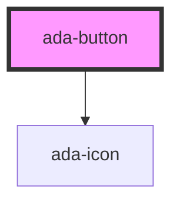

# ada-button

<!-- Auto Generated Below -->

## Properties

| Property             | Attribute    | Description                                                 | Type                                               | Default      |
| -------------------- | ------------ | ----------------------------------------------------------- | -------------------------------------------------- | ------------ |
| `color`              | `color`      | Define color of button                                      | `"default" \| "light" \| "primary" \| "secondary"` | `"primary"`  |
| `disabled`           | `disabled`   | Define whether button is enabled/disabled                   | `boolean`                                          | `false`      |
| `fullWidth`          | `full-width` | Define whether button is full width or not                  | `boolean`                                          | `false`      |
| `iconName`           | `icon-name`  | Define iconName for button                                  | `string \| undefined`                              | `undefined`  |
| `label` _(required)_ | `label`      | Define Label of button                                      | `string`                                           | `undefined`  |
| `size`               | `size`       | Define size of button                                       | `"l" \| "m" \| "s"`                                | `"m"`        |
| `type`               | `type`       | Define the type of button: `icon`, `standard`, `label-icon` | `"icon" \| "label-icon" \| "standard"`             | `"standard"` |
| `variant`            | `variant`    | Define look of button                                       | `"fill" \| "outline" \| "text"`                    | `"fill"`     |

## Events

| Event     | Description      | Type                |
| --------- | ---------------- | ------------------- |
| `clicked` | Emit click event | `CustomEvent<void>` |

## Dependencies

### Depends on

- [ada-icon](../icon)

### Graph

----------------------------------------------

*Built with [StencilJS](https://stenciljs.com/)*
