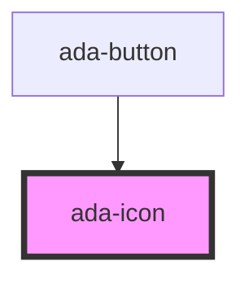

# ada-icon

<!-- Auto Generated Below -->

## Properties

| Property | Attribute | Description                 | Type                                | Default |
| -------- | --------- | --------------------------- | ----------------------------------- | ------- |
| `name`   | `name`    | It defines name of the icon | `string`                            | `"pen"` |
| `size`   | `size`    | It defines size of the icon | `"l" \| "m" \| "s" \| "xl" \| "xs"` | `"m"`   |

## Shadow Parts

| Part             | Description |
| ---------------- | ----------- |
| `"icon-element"` |             |

## Dependencies

### Used by

 - [ada-button](../button)

### Graph

----------------------------------------------

*Built with [StencilJS](https://stenciljs.com/)*
